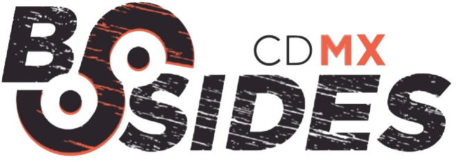
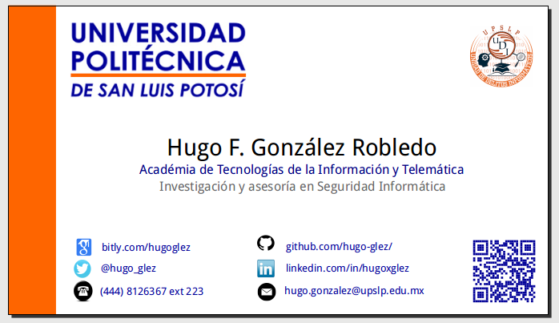
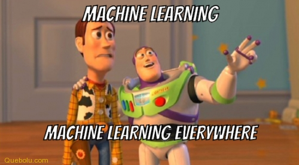
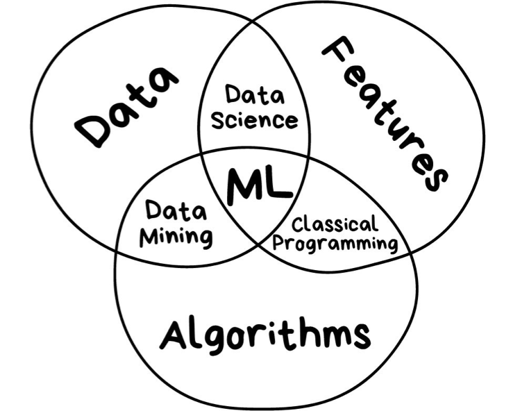
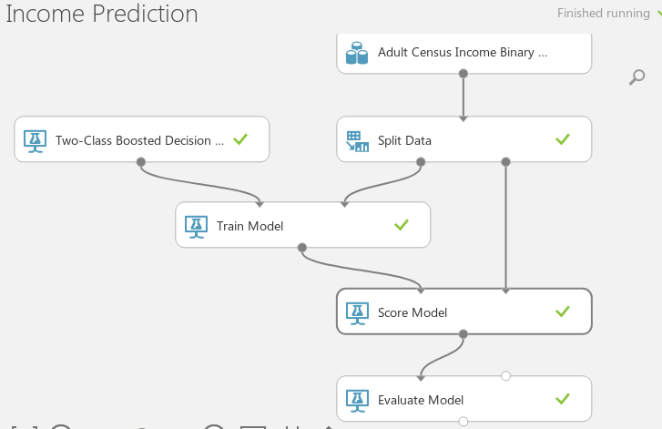
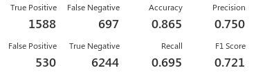

<!--
$theme: gaia
-->
Cloud Machine Learning for Cybersecurity
==
 2019

Hugo Gonzalez
-
##### @hugo_glez
hugo.gonzalez@upslp.edu.mx
[http://atit.upslp.edu.mx/~hugo/](http://atit.upslp.edu.mx/~hugo/)
http://www.github.com/hugo-glez/

---
## hugo@bsidescdmx2019$  whoami

Professor at Polytechnics University of San Luis Potosi (-)

	- IoT malware
	- Machine Learning
	- Teaching Cybersecurity: gamification, CTF 	

Graduated from Canadian Institute for Cybersecurity (2017)

	- Android malware authorship attribution 

Honeynet member (2007)

	- GSoC mentor, Android stuff.	
---
## hugo@bsidescdmx2019$  ristretto card.png

 

---
## hugo@bsidescdmx2019$  w

16:00:00 up 4 days,  3:35,  27 users,  load average: 1.41, 1.10, 1.08
USER    ______    FROM     ______   LOGIN@  _________    WHAT

_

.
.
.

.

---
## hugo@bsidescdmx2019$  cat Agenda.txt
1. Data Science Introduction (Videos)
2. Short introduction to Machine Learning
3. Process
4. AzureML studio
5. Cybersecurity/InfoSec use cases
	1. Url classification (CIC dataset)
	2. VPN vs NO-VPN (CIC dataset)
	3. IDS dataset (CIC dataset)
6. Crafting features
	1. WAF dataset
7. Advance usages
---

# Data, slides, code

http://github.com/hugo-glez/bsidescdmx2019/

###  More info and data related
http://github.com/hugo-glez/awesome-ml-for-cybersecurity

---

# Data Science Introduction (Videos)
---
Videos from Microsoft ...

---
# Short introduction to Machine Learning
---
 

---

 

---

1. We need DATA! a lot of it
2. Different techniques / algorithms
	1. Classification
	2. Prediction
	3. Clustering
	4. Anomaly detection
---
## Algorithms supported by AzureML

[https://azuremlsimpleds.azurewebsites.net/simpleds/](https://azuremlsimpleds.azurewebsites.net/simpleds/)

---
# Process
---
1. Get data (dataset)
2. Data cleansing
3. Data partition
4. Algorithm selection
5. Train the model
6. Test the model
7. Evaluate the model

---
 

---
## hugo@bsidescdmx2019$ ristretto evalua.png

 

---
## Accuracy
Acc = TP + TN / TP + TN + FP + FN
## Precision
Precision = TP / TP+FP
## Recall
Recall = TP / TP+FN
## F1-score
F1 Score = 2*(Recall * Precision) / (Recall + Precision)

https://blog.exsilio.com/all/accuracy-precision-recall-f1-score-interpretation-of-performance-measures/

---

# AzureML studio
---
## Cloud base Machine Learning studio
1. Cloud base
	- You only need a browser !!!
	- Free to try
	- Paid to use webservices
	- Do not need to write code (almost)
2. MS service

---
http://studio.azureml.net

---
# Cybersecurity/InfoSec use cases
	1. Url classification (CIC dataset)
	2. VPN vs NO-VPN (CIC dataset)
	3. Botnets (CIC dataset)
	
---
# Url Classification (CIC dataset)

- Dataset is clean and ready to use it.
- Five classes of URLS
- Load into AzureML studio
- Create the flow (follow me)

---

---

# VPN vs NO-VPN (CIC dataset)

- Data based on network flows of VPN and no-VPN 
- Binary classification

---

---
# Crafting features
	1. WAF dataset

---

---

# Advance usages

---
1. Clean data
2. Transform data

---

## hugo@bsidescdmx2019$ poweroff
Thanks!
 